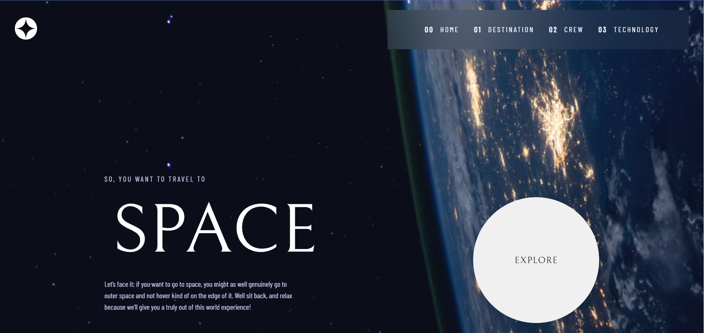
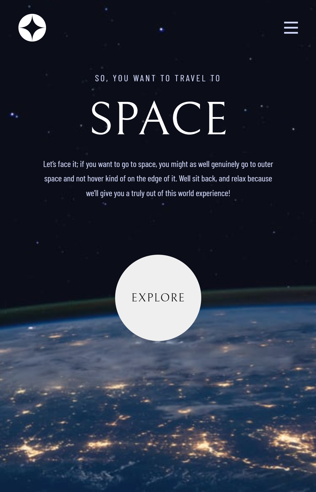

# Frontend Mentor - Space tourism website solution

This is a solution to the [Space tourism website challenge on Frontend Mentor](https://www.frontendmentor.io/challenges/space-tourism-multipage-website-gRWj1URZ3). Frontend Mentor challenges help you improve your coding skills by building realistic projects.

## Table of contents

- [Overview](#overview)
  - [The challenge](#the-challenge)
  - [Screenshot](#screenshot)
  - [Links](#links)
- [My process](#my-process)
  - [Built with](#built-with)
  - [What I learned](#what-i-learned)
  - [Continued development](#continued-development)
  - [Useful resources](#useful-resources)
- [Author](#author)
- [Acknowledgments](#acknowledgments)

## Overview

### The challenge

Users should be able to:

- View the optimal layout for each of the website's pages depending on their device's screen size
- View each page and be able to toggle between the tabs to see new information

### Screenshot

-Desktop Size Version

-Tablet Size Version

-Mobile Size Version

### Links

- Solution URL: [Add solution URL here](https://github.com/theonlylooker/space-tourism)
- Live Site URL: [Add live site URL here](https://reliable-daifuku-91f379.netlify.app/)

## My process

### Built with

- HTML5
- CSS
- Flexbox
- Mobile-first workflow
- [React](https://reactjs.org/) - JS library

### What I learned

I Learned a lot about the use of SVG files, and the problems and solutions about how to load them dinamically, also an use of
diferent promises in a single call with a promises all asyc function

### Continued development

I want to focus more on CSS, i build the project before watching the solution of kevin powell and after watching the solution i understood the way of using utiliy variables, i wanto to be able to separate and have a better understanding of CSS

### Useful resources

- [resource 1](https://www.sanity.io/guides/import-svg-files-in-react) - This helped me understand the use of svg files on react

## Author

<!-- - Website - [Onlylooker](https://www.your-site.com) -->

- Frontend Mentor - [@theonlylooker](https://www.frontendmentor.io/profile/theonlylooker)
